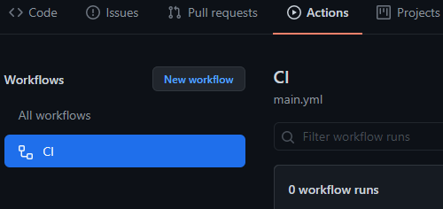
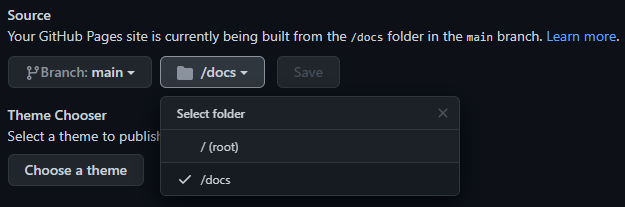

# 🌓 Automated Notion-based Github Page

Notion's visuals make it great for a simple portfolio website but their public page isn't designed for website hosting.

Loconotion is a great python script that will parse a public Notion page and create a static site.

This repo takes that a step further using Github Pages and Actions to build the static site into /docs. Updating the website is only done by triggering the workflow, meaning no files have to be manually handled or pushed.

The Github hosted runner ubuntu-latest includes everything we need to build loconotion (https://docs.github.com/en/actions/using-github-hosted-runners/about-github-hosted-runners#supported-software):

- python3
- pip3
- chrome/chromium
- chromedriver

## Usage

- Clone this repo and rename it
- Edit [site.toml](site.toml) to use your Notion.so public link
- Make any other loconotion config changes in [site.toml](site.toml)
- Add [loconotion](https://github.com/leoncvlt/loconotion) to submodule

```typescript
git submodule add https://github.com/leoncvlt/loconotion loconotion
```

- Run the CI [workflow](.github/workflows/main.yml) on menu Actions your repository



- Setting source github page to **/docs** on menu Settings -> Pages your repository



## To-Do

See if Notion can somehow trigger a remote trigger for the workflow.

## Source

[](https://github.com/lucakr/lucakr.github.io)
